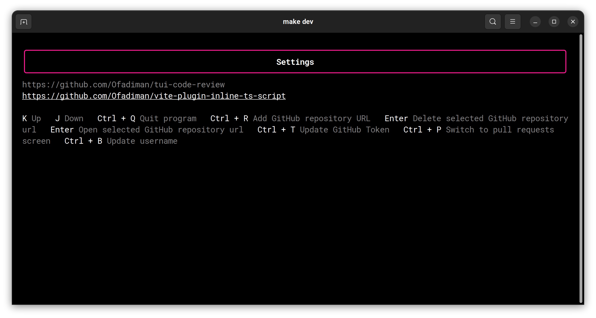

# TUI Code Review

TUI Code Review is a terminal-based application that allows users to view a list of pull requests on GitHub for which
they have been marked for code review. The application fetches data from the GitHub API to display a list of pull
requests awaiting review and another list of pull requests that the user has already reviewed.

Users can configure the repositories that they want to display in the application.

The application's user interface is simple and easy to navigate. Users can view the pull requests in a tabular format
and sort them based on different criteria. The user can select a pull request to open it in the default browser.

TUI Code Review simplifies the code review process by providing an easy-to-use interface to manage pull requests. The
application is especially useful for users who need to review pull requests across multiple repositories.

### Technologies

- [bubbletea](https://pkg.go.dev/github.com/charmbracelet/bubbletea) is a framework for building tui applications in go.
- [bubbles](https://github.com/charmbracelet/bubbles) provides a set of components that go along with bubbletea.
- [lipgloss](https://github.com/charmbracelet/lipgloss) lets you easily style tui components.

### Features

On the initial page, the user is greeted with a list of pull requests in which he participates. There are 5 types of
pull request states which conform to GitHub UI. Usually, we want to pay more attention to pull requests that require our
review and ignore pull requests that are drafts as they still need some work. For this reason, pull requests are sorted
in the following order:

1. `review required`
2. `changes requested`
3. `commented`
4. `approved`
5. `draft`

We want to review pull requests in GitHub. For this reason, pressing `enter` button will open currently selected pull
request in default browser and pressing `Ctrl + O` combination will open all pull requests that are not in `draft` nor
in approved states.

In order to start seeing pull requests you have to add URLs of GitHub repositories that you want to track. Settings
screen shows you which repositories you are currently watching, as well as allows to open selected repository in default
browser.

GitHub API requires auth tokens with permissions to read data from private repositories. Head over
to [GitHub documentation](https://docs.github.com/en/authentication/keeping-your-account-and-data-secure/creating-a-personal-access-token#personal-access-tokens-classic)
and generate personal access tokens with `repo` permissions. Next, hit `Ctrl + T` to navigate to a form screen which
allows you to enter and save you access token. From now on, you can view pull requests in private repositories 🥳.

